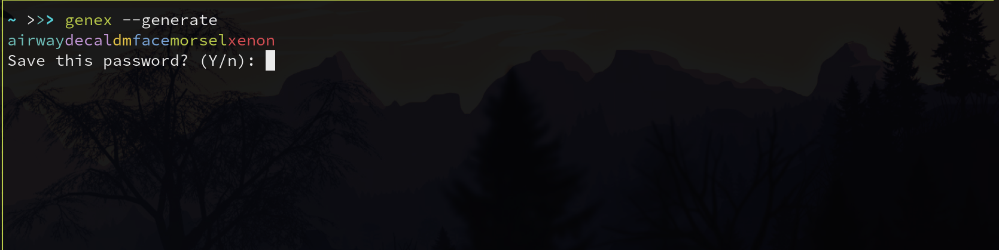

# Genex

Build a password from readable words using the [Diceware](http://world.std.com/~reinhold/diceware.html) word list.

## Installation

Grab the latest release from the [release](https://github.com/silbermm/genex/releases) page, and add it to your path

## Setup

Create a new rsa public/private keypair (requires openssl is installed on your system)

```
genex --create-certs
```

This creates two  files in a new folder in your home directory named `.genex/` (notice the `.` in the folder name). genex will use these files to encrypt and decrypt your passwords.

> Don't lose the private key, in fact, back it up somewhere safe. If you lose the file, there will be no way to recover your passwords!

## Usage

`genex --generate` will display a generated password on the screen. Continue to run it until you get one you can remember.



Once you agree that you want to save the password and enter an account to associate the password to, genex will add it to a file stored by default at `~/.genex/passwords`.

You can view your previously saved passwords using `genex --find account_name` where `acccount_name` is the account you saved your password under.

## Syncing passwords

Genex doesn't use cloud storage or servers to synchronize your passwords. Instead it gives you the power to decide where you want to store your passwords and which systems you trust to sync too/from.

There are currently two mechanisms to share passwords with other systems.
  * local file storage i.e a flash drive or hard drive
  * ssh (not yet implemented)

Both ways require other the other systems to have genex installed as well.

### Local file storage

TODO
